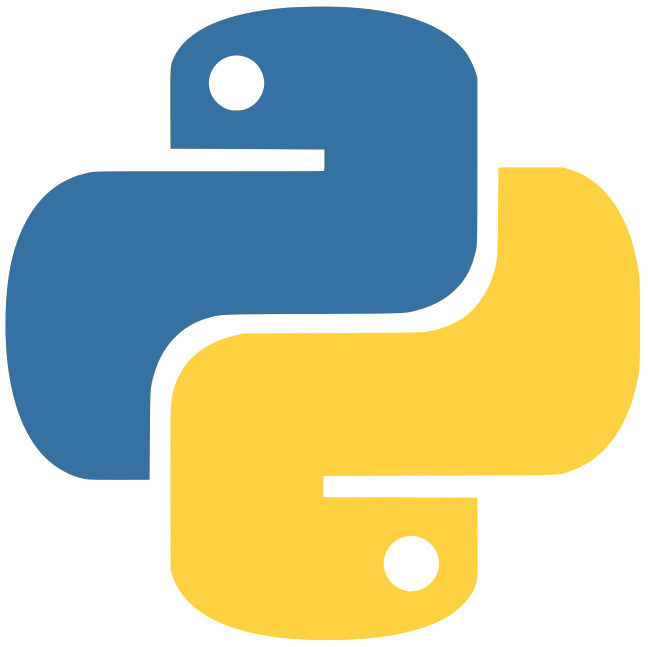
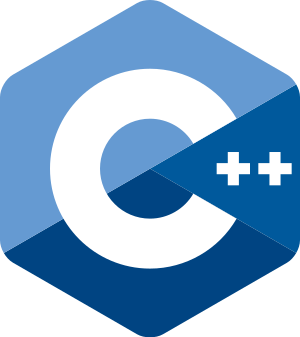
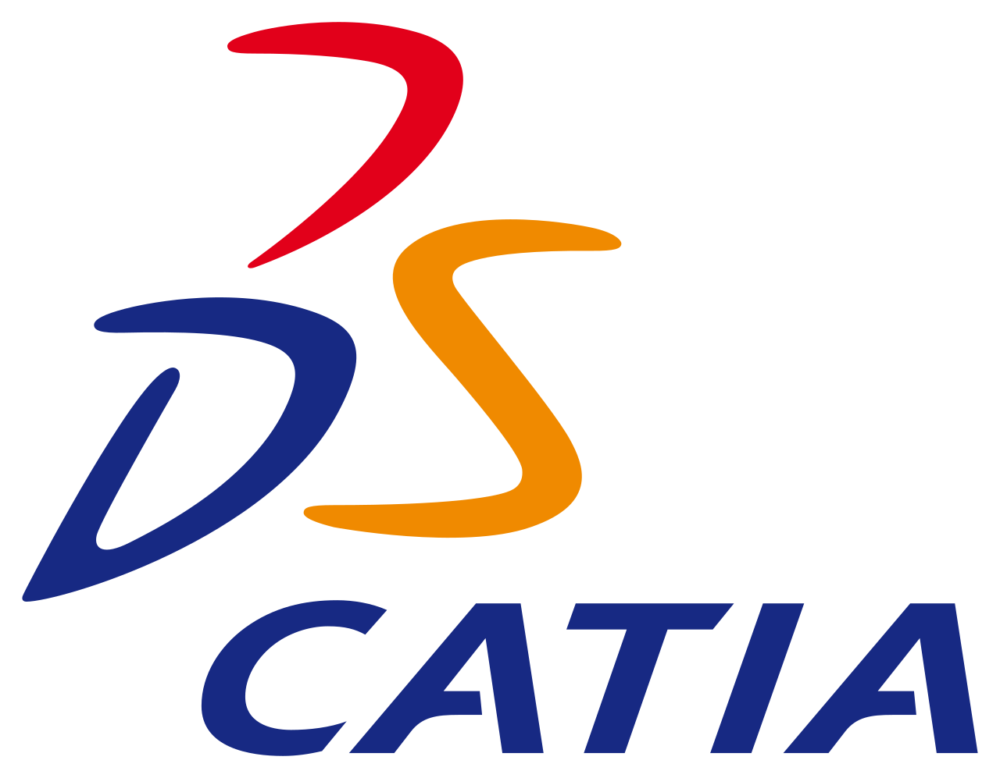

<!--
Michael Binder
============

-->

Affiliation
---------
2019-present
:   **Research assistant** at the institute for physiscs of the atmosphere (IPA), DLR Oberpfaffenhofen
    
    *Master thesis: Numerical simulations of deeply propagating mountain waves above the Andes*

Academic education
---------

2019-2021 (expected)
:   **MSc, Atmospheric Sciences**; University of Innsbruck
    
    *Thesis title: Numerical simulations of deeply propagating mountain waves above the Andes*

2014-2018
:   **BSc, Aerospace Engineering**; University of Stuttgart
    
    *Thesis title: FFI and WFI upgrade for SOFIA - preparation for environmental testing of the optics and on-sky tests*
    --Grade: 1.5--

2012-2014
:   **BSc, Electrical Engineering**; University of New Orleans & University of Kentucky

    --GPA: 3.9--

2000-2012
:   **General education (Abitur)**; Geschwister-Scholl-Schule Tübingen

    Grade: 1.5

Further education
----------

Tennis coach (C-Trainer)
:   Certified by the WTB/DTB (German tennis association)

Skitouring guide (C-Trainer)
:   Certified by the DSV/DOSB

Work experiences
--------------------

Research assistant at DLR Oberpfaffenhofen (2019)
:   LIDAR data analysis and visualization with Python and homepage development 

Internship and working student at Thales Alenia Space (2017)
:   Development of a complex simulator for satellite based air traffic surveillance including global air traffic, satellite constellations (interface to STK), communication links and a visualization framework

Tutor for JAVA programming lab of EE department (2015)
:   Supporting students in the development of a computer game with JAVA

Skills
--------------------
Programming languages & tools

    
    
    
    
    
    
    

Languages
<ul class="fa-ul mb-0 languages-ul">
    <li class="languages-li">
    <i class="fa fa-star"></i>
    <i class="fa fa-star"></i>
    <i class="fa fa-star icon-inline"></i>
    Deutsch</li>
    <li class="languages-li">
    <i class="fa fa-star"></i>
    <i class="fa fa-star"></i>
    <i class="fa fa-star-half-alt icon-inline"></i>
    English</li>
    <li class="languages-li">
    <i class="fa fa-star"></i>
    <i class="fa fa-star"></i>
    <i class="far fa-star icon-inline"></i>
    Español</li>
    <li>
</ul>

<!--
    <ul class="list-inline dev-icons"  style="padding-bottom: 20pt">
        <li class="list-inline-item">
        
        
        </li>
    </ul>
-->

Honors & Achievements
--------------------

2017-2018
:   BSc thesis within **SOFIA** at **NASA ARC**
    * scholarship of the **Baden-Württemberg foundation**
    * scholarship of the **Herman-Reissner foundation**
    * scholarship of the **Walter-Blohm foundation**

2016-2017
:   **Deutschlandstipendium (scholarship)**; University of Stuttgart
    

2012-2014
:   * **Student-athlete** at the University of Kentucky and the University of New Orleans (both Division I)
    * **Academic Honor Roll** of SEC; University of Kentucky

2005-2012
:   * **DTB C-Squad** (National tennis youth team)
    * Third place German championship singles and doubles
    * ...

Programming Languages
:   **first-lang:** Here, we have an itemization, where we only want
    to add descriptions to the first few items, but still want to
    mention some others together at the end. A format that works well
    here is a description list where the first few items have their
    first word emphasized, and the last item contains the final few
    emphasized terms. Notice the reasonably nice page break in the pdf
    version, which wouldn't happen if we generated the pdf via html.

[ref]: https://github.com/githubuser/superlongprojectname

